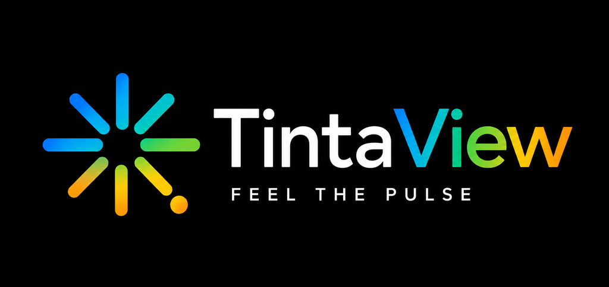

# TintaView




Your keyboard, mouse and headset lighting — plus a tray icon — mirror what your coding
agent is doing, in the TintaView mark's own colours: **green** when a session is open and
idle, **yellow** while it's working, and **red, blinking** when it needs you to act. When
no agent session is running, devices return to their previous lighting and the tray shows
the plain TintaView logo. Click the tray icon for a usage panel (5-hour /
weekly limits, credits, or token totals, depending on the agent). Works with
**Claude Code**, **Codex CLI** and **Cursor**; drives **Razer Chroma**, **Logitech G
HUB** or **OpenRGB** devices; runs on **Windows, WSL, Linux and macOS**. The usage panel
also has cards for **JetBrains AI Assistant** and **GitHub Copilot CLI** — neither lights
up (see below), but their usage shows up alongside the others.

## What works where

**Agents** — every agent reports session start/end and "working" the same way; only the
"needs your approval" signal differs:

| Agent | "Needs your approval" | Notes |
| --- | --- | --- |
| **Claude Code** | Real event (`Notification` / `permission_prompt`) | Works out of the box on every released build. |
| **Codex CLI** | Real event (`PermissionRequest`) | Hooks are version-gated — see [Troubleshooting](docs/TROUBLESHOOTING.md#codex-hooks-not-firing). Windows-native Codex (not under WSL) falls back to the `notify` program, which only reports idle. |
| **Cursor** | **Heuristic, not a real event.** Cursor has no "waiting for approval" hook, so TintaView guesses: if a tool starts and nothing else happens for `stall_seconds` (default 8s), it's treated as a stall and turns the light red. This can occasionally be wrong in either direction — see [Troubleshooting](docs/TROUBLESHOOTING.md#cursor-never-goes-red). |

**JetBrains AI Assistant** and **GitHub Copilot CLI** are not in that table — neither
gets lighting or session tracking, only a usage card (see [Usage stats](#usage-stats)).
JetBrains AI Assistant is an IDE plugin with no scriptable event API at all. Copilot
CLI actually has a rich hook system (`preToolUse`, `sessionStart`, `notification`, …),
but it's dispatched over an internal transport aimed at `@github/copilot-sdk`
embedders, not a documented external shell-command hook the other three expose.

**Lighting engines** — Chroma is the default when it's reachable:

| Engine | Windows | Windows + WSL | Linux | macOS |
| --- | --- | --- | --- | --- |
| **Chroma** (Razer) | Default | Default (daemon runs on the Windows side) | Not available (Windows-only SDK) | Not available (Synapse was discontinued on macOS) |
| **G HUB** (Logitech) | Supported — G HUB can keep running | Supported (daemon runs on the Windows side) | Not available (Windows-only SDK) | Not available (Windows-only SDK) |
| **OpenRGB** (Razer, Logitech, Corsair, ASUS, …) | Supported | Supported | Supported — best device coverage | Very limited device support |
| **Status-only** | Always available | Always available | Always available | Always available |

In practice: **macOS gets status and usage stats only, no physical lighting.**
Chroma and G HUB are both Windows-only SDKs, and OpenRGB's macOS device support is too
thin to rely on. If your devices are Logitech, prefer **G HUB** over OpenRGB — it's the
one engine that doesn't need you to quit the vendor app first (see
[Troubleshooting](docs/TROUBLESHOOTING.md#openrgb-fights-synapse--g-hub)).

## Install

### Windows

Open PowerShell and run:

```powershell
irm https://raw.githubusercontent.com/GomelHawk/TintaView/main/packaging/install.ps1 | iex
```

That's it — no admin rights (it installs per-user under `%LOCALAPPDATA%\TintaView`), no
security warnings, and it finishes by launching the setup wizard.

**Requires Python 3.12 or newer.** If you don't have one, the script tells you and stops;
`winget install --id Python.Python.3.12 --exact --source winget` is the one-liner it
suggests.

To pass options, run it as a script block instead (piping into `iex` can't forward
arguments):

```powershell
& ([scriptblock]::Create((irm https://raw.githubusercontent.com/GomelHawk/TintaView/main/packaging/install.ps1))) -NoAutostart
```

- `-Prefix DIR` — install location (default `%LOCALAPPDATA%\TintaView`).
- `-Version X.Y.Z` — install a specific release instead of the latest.
- `-Python EXE` — use a particular interpreter instead of the newest one found.
- `-NoAutostart` — skip the "start when I sign in" entry.
- `-NoWizard` — don't launch the setup wizard afterwards.
- `-Uninstall` — remove the app and its autostart entry. Your config, hooks and logs are
  left alone on purpose (on Windows they live in that same folder).

Every option also reads a `TINTAVIEW_*` environment variable (`TINTAVIEW_PREFIX`,
`TINTAVIEW_NO_AUTOSTART`, …), so the plain piped one-liner above stays configurable.

Re-running the script is also how you **update** — it upgrades in place and never touches
your config, hooks or autostart choice. `tintaview update` just does this for you.

<details>
<summary>Why a command, and why no .exe download?</summary>

TintaView isn't code-signed, and Windows has two independent defences against unsigned
software. A downloadable installer loses to both:

1. **Mark-of-the-Web.** Browsers tag every download with it. That tag is what makes
   Edge/Chrome block an unsigned installer on reputation, and what makes SmartScreen show
   "Windows protected your PC" when you run it. PowerShell doesn't attach the tag, so
   neither check has anything to fire on. Downloading a `.zip` and extracting it by hand
   doesn't help either — Explorer's extractor copies the tag into every file it writes.

2. **Smart App Control**, on by default on clean Windows 11 installs. Mark-of-the-Web is
   irrelevant to it: it refuses to run *any* executable that is neither signed nor already
   known-good to Microsoft's cloud. A compiled bundle can never satisfy it without a
   certificate, because every release produces a brand-new unique binary that has no
   reputation and never gets the chance to build one.

So TintaView is installed the way Python tools normally are: a private virtual environment
under the install folder, with the app installed into it from a wheel. The only programs
involved are Python's own interpreter — signed by the Python Software Foundation — and
packages from PyPI that millions of machines already run. Both defences are satisfied with
no certificate and no warnings to click through.

The install script downloads the wheel from the GitHub release, **verifies its SHA-256**
against the release's `SHA256SUMS.txt`, and refuses to install on any mismatch.

</details>

If you're on Windows with WSL, the setup wizard detects it and offers a **WSL split**
install: the tray and lighting stay on Windows, and the wizard installs the hooks
inside the Linux distro where your agents actually run, over `wsl.exe`. You never need
to open a WSL terminal yourself.

### Linux / macOS

```sh
curl -fsSL https://raw.githubusercontent.com/GomelHawk/TintaView/main/packaging/install.sh | sh
```

Or, from a local checkout:

```sh
sh packaging/install.sh [--prefix DIR] [--no-autostart] [--headless] [--uninstall]
```

- `--prefix DIR` — install location (default `~/.local/share/tintaview`).
- `--no-autostart` — skip wiring up a login autostart entry.
- `--headless` — skip the PySide6 tray dependency and register a headless (no-tray)
  autostart entry instead, for servers or WSL-only boxes with no desktop session.
- `--uninstall` — remove the autostart entry and the install prefix. Your config and
  installed hooks under `~/.tintaview` are left alone on purpose.

This script is also how you **update**: re-running it (with the same `--prefix`)
reinstalls into the existing virtual environment in place — nothing is duplicated, and
your config and hooks are never touched.

### After installing, either way

```sh
tintaview setup
```

This is the wizard that actually configures anything — the installer only puts files on
disk. Nothing lights up and no hooks are installed until you've run it.

## What the wizard asks

`tintaview setup` runs the same seven-step flow whether it's launched by `install.ps1`,
by `install.sh`, or by hand:

1. **Platform** — auto-detected (Windows / WSL / Linux / macOS), with a prompt to
   override it if detection guessed wrong.
2. **Agents** — probes `~/.claude`, `~/.codex`, `~/.cursor` and `PATH`, pre-ticks
   whatever it finds, and asks which you want TintaView to watch (at least one).
3. **Lighting engine** — probes Chroma, G HUB and OpenRGB and shows each as detected /
   not running / unsupported here; warns that OpenRGB and Razer Synapse / Logitech G HUB
   fight over the same hardware (G HUB itself doesn't — it can keep running), and that
   Linux OpenRGB usually needs udev rules and the `i2c-dev` kernel module. Pinning
   **Logitech G HUB** prints the ON/OFF checklist for G HUB (Game lighting control and
   the TintaView integration on; onboard memory, Windows Dynamic Lighting and OpenRGB
   off).
4. **Install location** — where the program files go (separate from your settings,
   which always live under `~/.tintaview` or `%LOCALAPPDATA%\TintaView`).
5. **Autostart** — a per-user `Run` registry entry (Windows), a systemd `--user` unit plus
   an XDG autostart entry (Linux), or a launchd agent (macOS). No admin, no Scheduled Task.
6. **Hooks** — for each agent, shows the exact before/after diff of the config file
   it's about to write and asks for confirmation before touching anything.
7. **Verify** — saves the config, installs the hook script, then optionally waits
   (about a minute) for a real event from your agent so you know it actually worked.

Answer every question with its default and skip the prompts entirely with
`tintaview setup -y`.

## Usage stats

Click the tray icon to open the usage panel. What you see depends on the agent:

- **Claude Code** — the same official 5-hour / weekly / usage-credit percentages Claude
  Code's own `/usage` command shows, read from `https://api.anthropic.com/api/oauth/usage`
  with your existing OAuth token. If that endpoint is unreachable, TintaView falls back
  to an estimate reconstructed from your local transcripts, clearly labelled "estimate".
- **Codex CLI** — official rate-limit percentages when your local session logs carry
  them (ChatGPT-plan sessions); plain token totals over the last 5 hours / 7 days
  otherwise (API-key sessions don't get percentages from Codex at all). Entirely local
  — no network call.
- **Cursor** — **unofficial**. There is no published personal-usage API, so TintaView
  reads the access token Cursor already keeps in its local `state.vscdb` and calls the
  same internal endpoint the Cursor app itself uses. This can break on any Cursor
  release with no warning; when it does, the panel just says usage is unavailable —
  lighting is unaffected either way.
- **JetBrains AI Assistant** — entirely local, no network call and no hooks. TintaView
  reads the same quota cache (`AIAssistantQuotaManager2.xml`) the IDE's own AI Assistant
  status-bar widget uses. Quota is account-wide but each installed IDE only syncs its
  own copy when it last talked to JetBrains, so TintaView uses whichever IDE's copy was
  updated most recently.
- **GitHub Copilot CLI** — entirely local, no network call. There's no official
  percentage here: GitHub's real quota comes from an internal endpoint that needs a
  token out of the OS credential store via a two-step exchange, which TintaView
  doesn't attempt. Instead it sums input/output tokens per model, over the last 7
  days, from `~/.copilot/session-store.db` — informational totals, not a limit.

Usage is polled every 5 minutes (rate limits, not urgency) and the last good result is
cached, so the panel is never blank and a rate-limit response never overwrites good data
with a worse estimate.

## Configuration

One file: `~/.tintaview/config.toml` (Windows: `%LOCALAPPDATA%\TintaView\config.toml`),
written by `tintaview setup` and safe to hand-edit afterwards.

| Key | Default | Meaning |
| --- | --- | --- |
| `server.host` | `127.0.0.1` | Where the status broker listens. |
| `server.port` | `8777` | Port for the status broker (hooks and the tray both talk to this). |
| `server.watchdog_timeout` | `600` | Seconds of hook silence before the lights are force-released (crash safety). |
| `engine.mode` | `auto` | `auto` \| `chroma` \| `ghub` \| `openrgb` \| `none`. `auto` probes `engine.order` and uses the first that responds. |
| `engine.order` | `["chroma", "ghub", "openrgb"]` | Probe order for `auto` mode. |
| `engine.chroma.devices` | `["mouse", "headset"]` | Chroma device endpoints to drive. |
| `engine.ghub.dll_path` | *(auto-detected)* | Path to the Logitech LED Illumination SDK DLL; empty searches `LGHUB\\sdks\\` then the G HUB install root, the registry, then `PATH`. |
| `engine.ghub.device_types` | `["monochrome", "rgb", "perkey"]` | Which SDK device *classes* to drive — a capability bitmask, not per-device targeting like OpenRGB's `device_types`; there's no way to address "just the mouse". |
| `engine.ghub.restore_on_release` | `true` | Save the current lighting on open, restore it on close. |
| `engine.openrgb.host` / `.port` | `127.0.0.1` / `6742` | Where the OpenRGB SDK server is listening. |
| `engine.openrgb.device_types` | `["mouse", "keyboard", "headset"]` | Which OpenRGB devices to drive. Peripherals only by default — motherboard, RAM, GPU and case lighting is ambient decoration, and driving it makes the whole room flash on every tool call. Set to `[]` for every detected device, or add any `openrgb.utils.DeviceType` name (e.g. `"mousemat"`). |
| `engine.openrgb.restore_on_release` | `true` | Snapshot each device's mode/colors on open, restore them on close. |
| `engine.openrgb.direct_mode_only` | `true` | Only drive devices that expose a Direct mode, to avoid flash wear from blinking. |
| `colors.idle` | `#56D155` | Green — a session is open and the agent is waiting on you. |
| `colors.working` | `#F0B30C` | Yellow — the agent is busy. |
| `colors.confirm` | `#F42D3C` | Red, blinking — the agent needs you to act. |
| `colors.none` | `#0080F7` | Unused by the running app — no session never paints a colour, it just releases devices back to their prior state and shows the plain logo in the tray. Kept only as a fallback default. |
| `colors.blink_ms` | `400` | Blink interval for the `confirm` state, in milliseconds. |
| `stats.poll_seconds` | `300` | How often usage providers are polled. |
| `stats.enabled` | `true` | Turn the usage panel off entirely. |
| `ui.chime_on_confirm` | `false` | Play a sound when a session first needs your approval. |
| `update.check` | `true` | Whether the tray checks GitHub Releases for a newer version. |
| `update.channel` | `stable` | Update channel (currently only `stable` is published). |
| `agents.enabled` | `["claude"]` | Which agents TintaView watches, **in display order** — this list's order is also the order sections appear in the tray flyout and tooltip. The wizard sets this for you, in the order you type the agents' numbers. |
| `agents.<key>.home` | *(adapter default)* | Agent data directory — empty means `~/.claude` / `~/.codex` / `~/.cursor` / `~/.copilot`; a UNC path in a WSL-split install. |
| `agents.<key>.confirm_detection` | `event` | `event` (a real hook fires) or `stall` (heuristic — Cursor's default). |
| `agents.<key>.stall_seconds` | `8.0` | Only used when `confirm_detection = "stall"`. |
| `agents.cursor.state_db` | *(auto-detected)* | Path to Cursor's `state.vscdb`; empty auto-detects the platform default. |
| `agents.jetbrains.quota_path` | *(auto-detected)* | Path to a specific `AIAssistantQuotaManager2.xml` or IDE data directory; empty scans every installed JetBrains IDE and uses the most recently updated one. |

## Commands

| Command | Description |
| --- | --- |
| `tintaview` | Run the tray UI with the status broker in-process (the normal case). |
| `tintaview run [--headless]` | Same as above; `--headless` runs the broker only, with no GUI. |
| `tintaview setup [--platform P] [-y]` | Run the install/reconfigure wizard. `--platform` overrides platform detection; `-y` accepts every default. |
| `tintaview doctor [-v]` | Diagnose an install — see [Troubleshooting](docs/TROUBLESHOOTING.md). `-v` also offers a live 30-second hook test. |
| `tintaview hooks {install,status,uninstall} [--agent A] [--scope user\|project] [--hook-bin PATH] [--all-agents] [-y]` | Manage one agent's (or all agents') hook configuration, with a diff-and-confirm flow. |
| `tintaview update [--check-only]` | Check for, and install, a newer version. |
| `tintaview --version` | Print the installed version. |

## How it works

```
Claude Code / Codex CLI / Cursor
        │  hook fires on session start/end, prompt submit, tool use, permission prompt
        ▼
tv-hook.sh / tv-hook.cmd         (~5 ms: sh/cmd + curl, no Python, always exits 0)
        │  GET /v1/event/<event>?agent=<agent>&sid=<session>
        ▼
TintaView status broker (127.0.0.1:8777, in-process with the tray)
        │  tracks state per (agent, session); confirm > working > idle > none
        ▼
Lighting engine (Chroma / OpenRGB / none)
        │
        ▼
Mouse / keyboard / headset LEDs

The tray reads the broker's state directly in-process (no HTTP hop) to paint its icon
and tooltip, and polls the same GET /state endpoint a doctor or a remote tool would use.
```

## Updating

- The tray checks GitHub Releases once, automatically, on every start (set
  `update.check = false` to turn this off) — if a newer version exists it shows a
  tray notification, without interrupting anything or installing on its own. Use the
  tray's **Check for updates** menu item any time to see the same check as a dialog
  and choose to install.
- **Windows** — to install a newer version, use the **Check for updates** menu item
  and accept the prompt, run `tintaview update` from a terminal, or re-run the
  `install.ps1` one-liner yourself.
- **Linux / macOS** — re-run `packaging/install.sh` (or `tintaview update`, which does
  the same thing).

Either way `tintaview update` downloads that platform's install script, **verifies its
SHA-256** against the release's checksums file, and refuses to run anything that doesn't
match.

Updating never touches `config.toml` or any agent's hook configuration — hooks always
point at the same stable `tv-hook` path, so an update can never leave an agent's hooks
broken.

## Uninstall

- **Windows** — re-run the install one-liner with `-Uninstall`:

  ```powershell
  & ([scriptblock]::Create((irm https://raw.githubusercontent.com/GomelHawk/TintaView/main/packaging/install.ps1))) -Uninstall
  ```

  It removes the virtual environment, the Start Menu shortcut and the autostart entry;
  your config, usage cache and logs under `%LOCALAPPDATA%\TintaView` are left in place.
- **Linux / macOS** — `sh packaging/install.sh --uninstall`. Same behaviour: the
  autostart entry and install prefix are removed, `~/.tintaview` is left alone.
- **Either way**, to also remove the hook entries TintaView installed into your agents'
  own config files, run this first (needs a working install, so do it *before*
  uninstalling, or reinstall to run it):

  ```sh
  tintaview hooks uninstall --agent all
  ```

  Leaving them in place is harmless — an agent calling a hook with nothing listening on
  the other end fails silently and always exits 0 — but they'll keep showing up in
  `tintaview hooks status` output on any other machine that shares the config.

## Contributing

[AGENTS.md](AGENTS.md) documents the internals: the layout, the locked design decisions and
why they're locked, the HTTP/event contracts, the packaging constraints, and the testing
conventions. Read it before changing anything.

## Credits & licence

MIT — see [LICENSE](LICENSE).

TintaView is not affiliated with or endorsed by Anthropic, OpenAI, GitHub, Cursor
(Anysphere), JetBrains, or Razer Inc. "Razer", "Chroma" and "Synapse" are trademarks
of Razer Inc. "Claude" and "Claude Code" are trademarks of Anthropic. "Codex" is a
trademark of OpenAI. "Cursor" is a trademark of Anysphere. "JetBrains" and "AI
Assistant" are trademarks of JetBrains s.r.o. "GitHub" and "GitHub Copilot" are
trademarks of GitHub, Inc.
